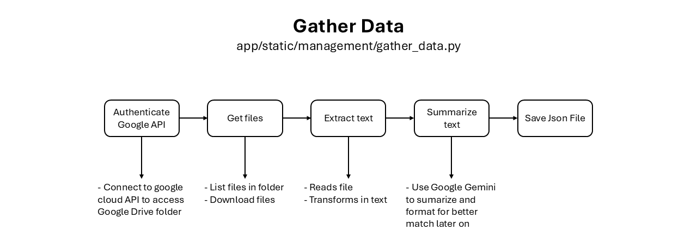
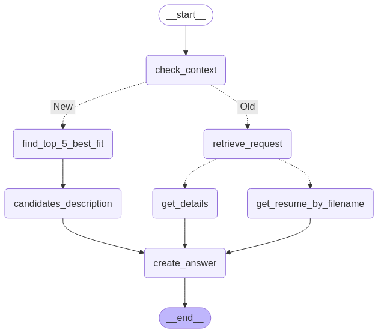

# 📄 Resume Screening System

## 📌 Overview

The **Resume Screening System** is an AI-powered tool that automates the process of screening resumes based on job descriptions. It leverages **Natural Language Processing (NLP)** to compare job requirements against candidates’ qualifications and ranks them based on relevance.

The system follows a **retrieval-augmented generation (RAG) approach** to match job descriptions with resumes, using **vector embeddings and similarity search**.

[Demo Video](https://youtu.be/UlUBYI-NSyE)

---

## Usage Example

This solution is ideal for recruiters, allowing them to input candidates resumes into the model and match them against the job description to assess the best fit for the position. If recruiters need more details, they can ask for it, and also download the resume for further review, incorporating a "human-in-the-loop" approach when using LLMs for the final assessment.

---

## Features

- **Automated Resume Matching** – Uses embeddings to compare resumes against job descriptions.  
- **Candidate Ranking** – Retrieves the most relevant resumes based on similarity scores.  
- **Django API Integration** – Provides an API for users to submit job descriptions and retrieve matched candidates.  
- **Interactive Chatbot** – Supports queries to fetch results dynamically.  
- **Downloadable Resumes** – Generates downloadable links for the shortlisted resumes.  

---

## Main Technologies Used

Python, LLMs (Google Gemini), LangChain, Vectorized Store, LangGraph, Pydantic, Django

---

## 📂 Set up instructions

Ensure you have Python installed (recommend Python 3.11+).

### Install dependencies

Make sure you have the file requirements.txt.

```python

pip install -r requirements.txt

```

### Install dependencies

Make sure you have a .env file in the root directory with the following information:

```python

GOOGLE_API_KEY="your_google_api_key_here"

```

### Start by running file in app/static/management/

Only needs to run this when gathering new resumes.

- Connect to Google Cloud API to get the resumes from the Google Drive folder, so that you can access them dynamically and have the files up to date.
    - Follow instructions on: [https://developers.google.com/drive/api/quickstart/python](https://developers.google.com/drive/api/quickstart/python)

Rest of code explanation:

- Extracts information from each resume, and create a structured summary with details from each candidate with the same format, for future better match criteria.
- Save the information as JSON file, to then use in other sections

---

## Data Storage

The files downloaded from the Google Cloud API are saved under app/static/files. The JSON file is saved under app/static/data.



---

## Project Structure & Workflow

### functions.py

Here is where I have most of the interactions between the functions I use with LangGraph, and also define AgentState to track the state I am during the process.

Details:

- **Model**: gemini-2.0-flash
- **Embeddings**: GoogleGenerativeAIEmbeddings (text-embedding-004)
- **Vector Store**: InMemoryVectorStore
- **Chat Memory (LangChain)**: ConversationBufferMemory

AgentState specifications:

- **user_input**: User's latest input message.
- **response**: Information for response.
- **related**: Relation of the new prompt with the last one.
- **retrieved_files**: Files selected from Vector Database.
- **last_action**: Keeps track of where we are.

Functions:

- **check_context**: Understands if the new message is related to an old topic, or if it is a new job description.
- **first_router**: With the output from the check_function, which was saved at our AgentState, we understand if we need to go to the function find_top_5_best_fit or retrieve_request.
- **find_top_5_best_fit**: Transforms the job description in a format to better match the format of the candidates information. Based on the similarity_search, retrieves the top 5 most similar values, which are the best fit for the position. Saves the information in our AgentState.
- **candidates_description**: Gets the information from each of the selected candidates in the AgentState.
- **retrieve_request**: Based on the request, understands if we want to get more details of the retrieved candidates, or their resumes.
- **get_details**: Gives more detailed information to the user about the candidates.
- **get_resume_by_filename**: Gets the name of the file associated with the candidates selected.
- **create_answer**: Final step, where we create an answer with the information retrieved.

### views.py

Here is where all the magic happens. I start by creating our LangGraph state and defining a node for each of the functions created.

#### LangGraph Workflow Description

I begin by setting the function **check_context** as the entry point. This function also serves as a conditional edge to determine whether the context is related to the last message or if it represents a new job description.

- If it is a new job description, we retrieve the top 5 candidates that best match the job opportunity using **find_top_5_best_fit**, and then generate a summary description for each candidate using **candidates_description**. After this, we proceed to **create_answer**.
- If it is related to the last message, we move to the function **retrieve_request**, which is also a conditional edge. Based on the request, it determines whether we should go to **get_details** to retrieve more information about the matched candidates or to **get_resumes_by_filename** if the user requests resumes. Both functions ultimately lead to create_answer.

The function **create_answer** is our finish point, where, based on the retrieved information, we generate a response to display to the user.

After this, the graph is compiled, and the following image represents the workflow:



#### Views Functions

This file also contains the views that trigger our actions:
- The **home_view**, it's simply to route to our landing page.
- The **chatbot_response**, processes message submissions, calls the workflow, and returns responses.
- The **resumes_page_view** is where I list all the resumes, for the user to access and open them.

### tests.py

In this file, I created a test where I compare the description created by ChatGPT for a specific candidate (based on the resume of the candidate), run the whole process, and at the end compare if the candidate selected was the best fit/correct one.

This test is successful.

---

## Templates

- **layout**: Page layout (top bar), to be reused on all pages.
- **home.html**: Simple interface for the user to interact with chat.
- **resumes_page.html**: List of resumes, with possibility of viewing them.

---

## Decisions and Challenges

### 📝 Decisions Made and Why

#### Choosing LangChain, LangGraph, and Pydantic

- Decided to use LangChain and LangGraph for structuring the AI workflow, memory and handling state, along with Pydantic for enforcing data validation. These tools provide modular, scalable, and structured approaches to building LLM-powered applications while ensuring data integrity.

#### Using Google Gemini

- Based on the recommendation and my eagerness to learn more, I decided to use/test a LLM I never used before, Google Gemini, and also because of how fast the API is and leverage Google's text-embedding-004 model for better search capabilities and retrieval of relevant resumes.

#### Implementing a Stateful Approach for Conversation Handling

- Instead of resetting state with every request, implemented a global state to persist user interactions. This approach helps maintain continuity in the conversation, ensuring the system remembers context and avoids reprocessing previous steps unnecessarily.

#### Structuring the Resumes

- When processing the resumes, created a structured summarization with detail, to match future job descriptions, which will also be in a similar format, to make sure we have the best match.

#### Storing and Retrieving Resumes Efficiently

- Stored processed resumes as JSON and used vector embeddings to match descriptions efficiently. This speeds up retrieval and avoids expensive repeated LLM calls, optimizing both performance and cost.

### 🚧 Challenges Faced and Solutions

#### Keeping State Without Resetting Every Request and make it global

- **Issue**: Using session-based state caused problems, where every request either reset state or carried over incorrect/unstructured data.
- **Solution**: Implemented a global AgentState object, ensuring state persistence without forcing resets between requests.

#### Handling Incorrectly Structured Data (Pydantic Errors)

- **Issue**: When using Pydantic, we need to be careful about how to update the data and also the type of the data to assign to our variables.
- **Solution**: Try different approach and data extraction to make sure we have the right output/type.